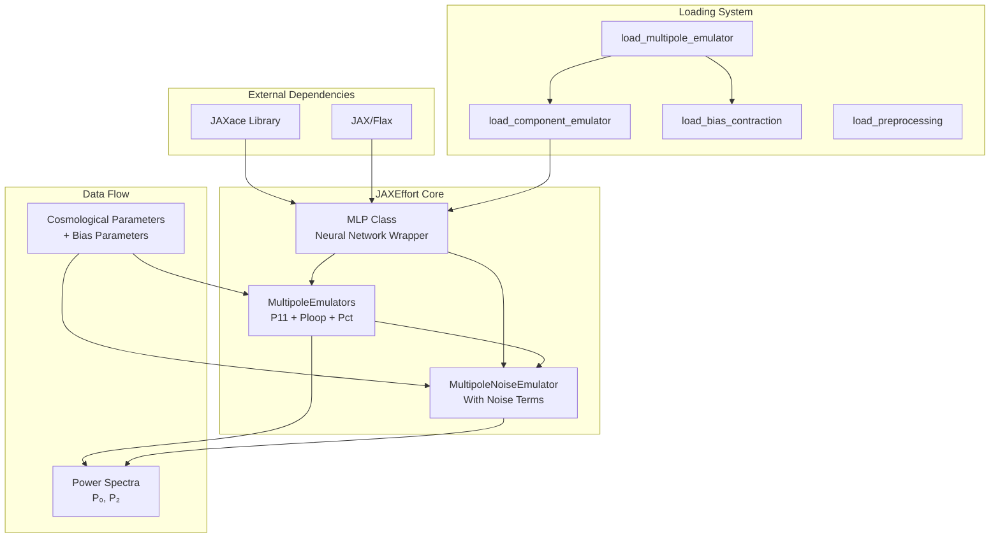
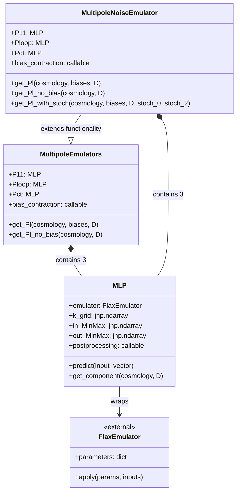
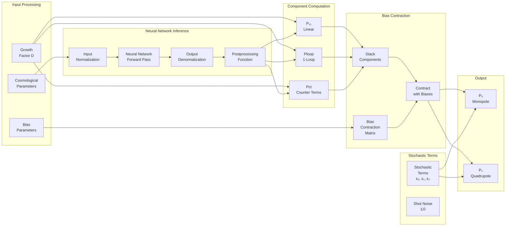
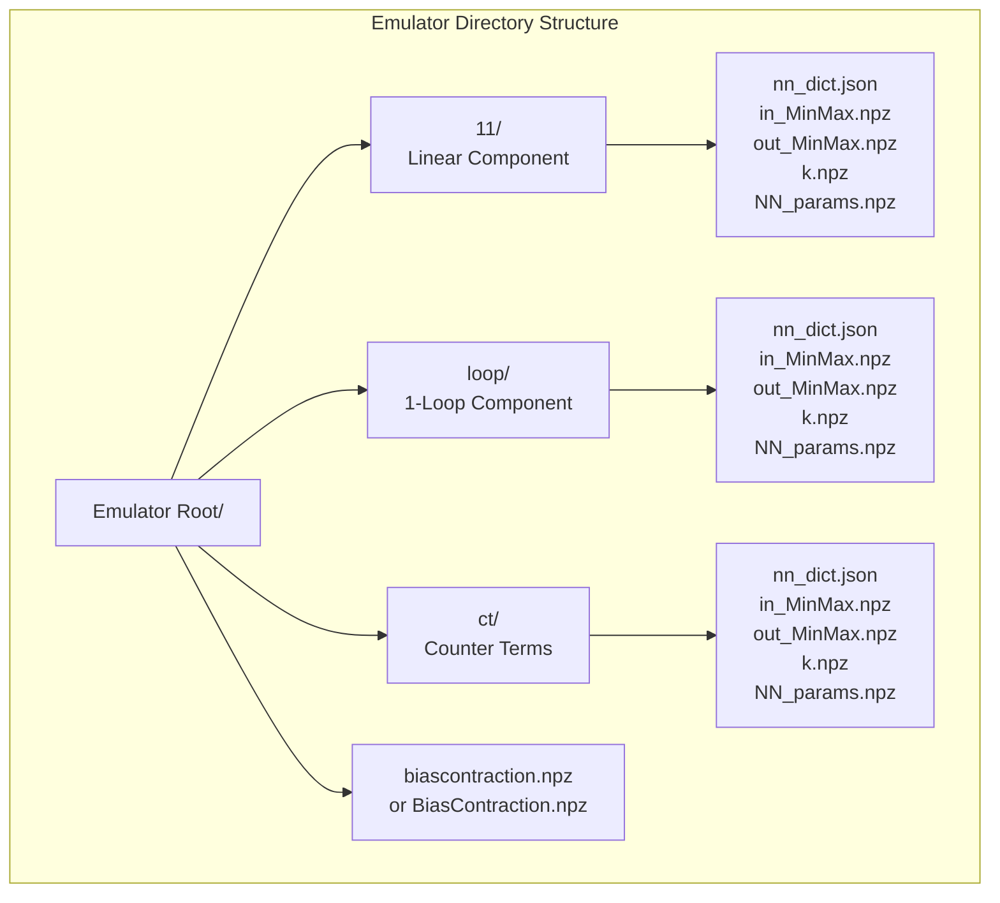
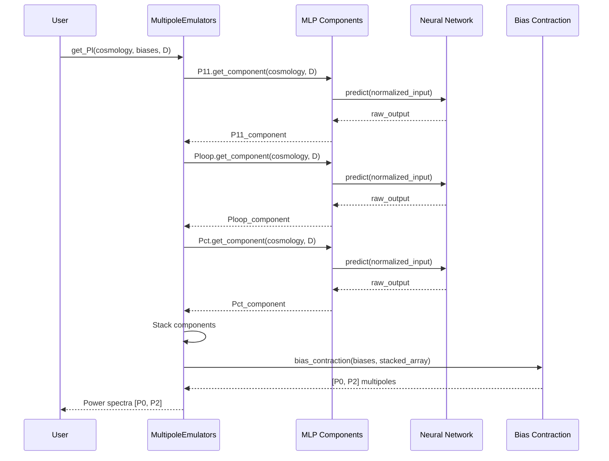
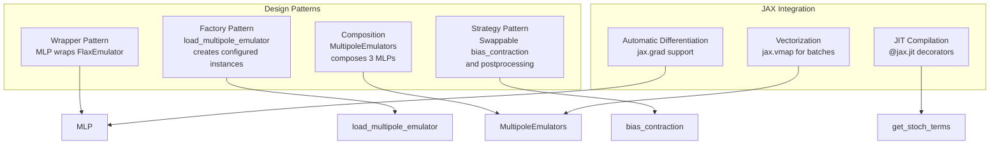

# JAXEffort Architecture Documentation

## System Overview

JAXEffort is a JAX-based galaxy power spectrum emulator that leverages neural networks to efficiently compute cosmological power spectra with galaxy bias modeling. The system is built on top of the JAXace library and uses the JAX ecosystem for automatic differentiation and JIT compilation.

## Architecture Diagrams

### 1. High-Level System Architecture



### 2. Class Hierarchy and Relationships



### 3. Data Processing Pipeline



### 4. File System Structure



### 5. Computation Flow for Power Spectrum



### 6. Key Design Patterns



## Component Descriptions

### Core Classes

1. **MLP**: Wrapper around JAXace's FlaxEmulator that handles:
   - Input/output normalization
   - Neural network inference
   - Postprocessing transformations
   - Component computation with growth factors

2. **MultipoleEmulators**: Combines three MLP components:
   - P11: Linear power spectrum
   - Ploop: One-loop corrections
   - Pct: Counter terms for UV regularization
   - Applies bias contraction to get multipoles

3. **MultipoleNoiseEmulator**: Extends MultipoleEmulators with:
   - Stochastic term computation
   - Shot noise contributions
   - Combined deterministic + stochastic output

### Loading System

The loading system follows a hierarchical pattern:
- `load_multipole_emulator`: Top-level factory function
- `load_component_emulator`: Loads individual MLP components
- `load_bias_contraction`: Loads bias contraction matrices
- `load_preprocessing`: Dynamically loads postprocessing functions

### Data Flow

1. **Input**: Cosmological parameters + galaxy bias parameters
2. **Normalization**: MinMax scaling to neural network range
3. **Inference**: Forward pass through trained neural networks
4. **Denormalization**: Scale back to physical units
5. **Postprocessing**: Apply any additional transformations
6. **Bias Contraction**: Combine components with bias model
7. **Output**: Monopole (ℓ=0) and quadrupole (ℓ=2) power spectra

## Dependencies

- **JAXace**: Provides cosmology functions and neural network infrastructure
- **JAX/Flax**: Core ML framework for automatic differentiation
- **NumPy**: Array operations and data handling

## Performance Characteristics

- **JIT Compilation**: All critical paths are JIT-compilable
- **Vectorization**: Supports batch processing via vmap
- **Gradient Support**: Fully differentiable for optimization
- **Memory Efficiency**: Operates on JAX arrays for GPU acceleration

## How to Visualize These Diagrams

To render these Mermaid diagrams:

1. **GitHub**: View this file directly on GitHub - it automatically renders Mermaid
2. **VS Code**: Install the "Markdown Preview Mermaid Support" extension
3. **Online**: Use [Mermaid Live Editor](https://mermaid.live/)
4. **Export**: Copy any diagram to Mermaid Live Editor to export as PNG/SVG

## Usage Example

```python
# Load trained emulator
emulator = load_multipole_emulator("/path/to/emulator/")

# Define cosmological parameters
cosmology = jnp.array([...])  # Cosmological parameters
biases = jnp.array([...])      # Galaxy bias parameters
D = 1.0                        # Growth factor

# Compute power spectra
P0, P2 = emulator.get_Pl(cosmology, biases, D)
```