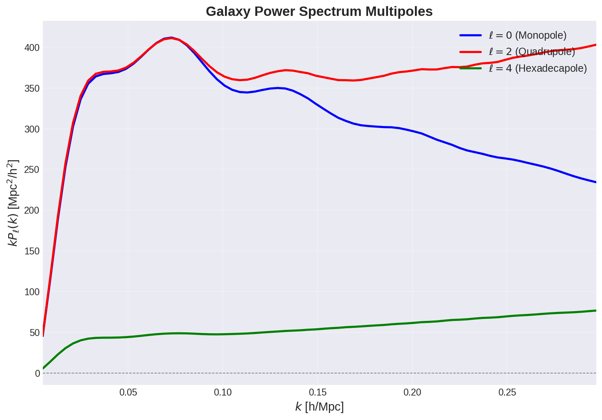

# jaxeffort

Welcome to the documentation for **jaxeffort**, a JAX-based emulator for galaxy power spectra with bias modeling and EFT corrections.

## Overview

jaxeffort provides fast and differentiable emulation of galaxy power spectrum multipoles, enabling:

- **Fast evaluation** of galaxy power spectra multipoles (P₀, P₂, P₄)
- **Automatic differentiation** through JAX for gradient-based inference
- **Bias modeling** with EFT corrections
- **GPU acceleration** for large-scale analyses



## Key Features

### 🚀 Performance
- Orders of magnitude faster than traditional Boltzmann solvers + perturbation theory codes
- Fully JAX-compatible for automatic differentiation
- GPU-accelerated computations

### 🎯 Accuracy
- Trained on high-precision PyBird calculations
- Sub-percent level accuracy across parameter space
- Validated against CLASS+PyBird pipeline

### 🔧 Flexibility
- Support for various cosmological models (ΛCDM, w₀wₐCDM with massive neutrinos)
- Full bias expansion including EFT corrections
- Easy integration with inference frameworks

## Quick Start

```python
import jaxeffort
import jax.numpy as jnp

# Load pre-trained emulators
P0 = jaxeffort.trained_emulators["pybird_mnuw0wacdm"]["0"]
P2 = jaxeffort.trained_emulators["pybird_mnuw0wacdm"]["2"]
P4 = jaxeffort.trained_emulators["pybird_mnuw0wacdm"]["4"]

# Set cosmological and bias parameters
cosmo_params = jnp.array([z, ln10As, ns, H0, ombh2, omch2, Mnu, w0, wa])
bias_params = jnp.array([b1, b2, b3, b4, b5, b6, b7, f])

# Compute growth factor
cosmo = jaxeffort.W0WaCDMCosmology(...)
D = cosmo.D_z(z)

# Get multipoles
P0_vals = P0.get_Pl(cosmo_params, bias_params, D)
P2_vals = P2.get_Pl(cosmo_params, bias_params, D)
P4_vals = P4.get_Pl(cosmo_params, bias_params, D)
```

## Installation

Install from PyPI:

```bash
pip install jaxeffort
```

Or install the latest development version:

```bash
git clone https://github.com/CosmologicalEmulators/jaxeffort
cd jaxeffort
pip install -e .
```

## Documentation Structure

- **[Usage Examples](usage_examples.md)** - Detailed examples and tutorials
- **[Data Management](examples/data_management.md)** - Managing emulator data
- **[API Reference](api.md)** - Complete API documentation
- **[Contributing](contributing.md)** - Guidelines for contributors

## Citation

If you use jaxeffort in your research, please cite:

M. Bonici, G. D'Amico, J. Bel, C. Carbone, [_Effort.jl: a fast and differentiable emulator for the Effective Field Theory of the Large Scale Structure of the Universe_](https://dx.doi.org/10.1088/1475-7516/2025/09/044), JCAP 09 (2025) 044