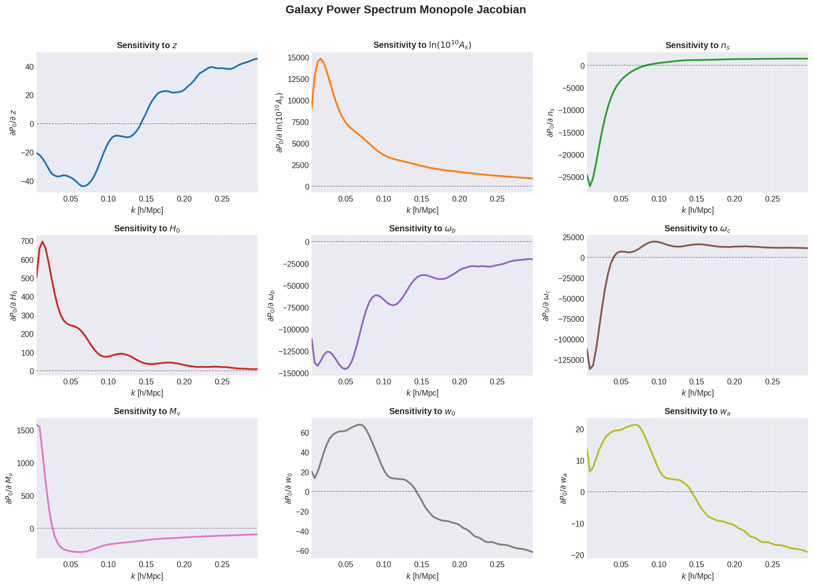
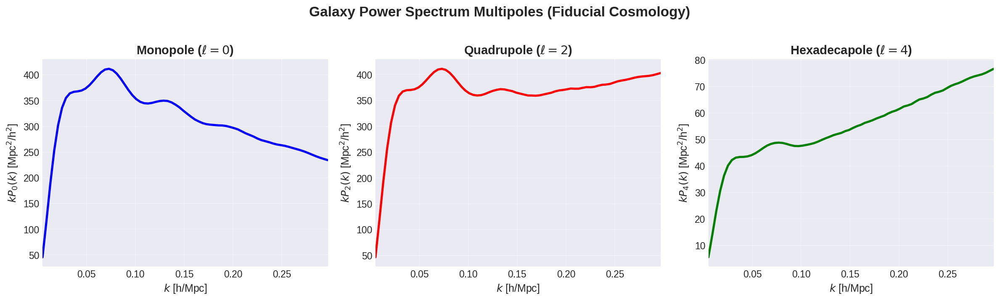

# Usage Examples

This page provides detailed examples of using jaxeffort for galaxy power spectrum emulation.

## Basic Usage

### Loading Emulators

jaxeffort comes with pre-trained emulators that can be loaded easily:

```python
import jaxeffort
import jax.numpy as jnp

# Load multipole emulators
P0 = jaxeffort.trained_emulators["pybird_mnuw0wacdm"]["0"]  # Monopole
P2 = jaxeffort.trained_emulators["pybird_mnuw0wacdm"]["2"]  # Quadrupole
P4 = jaxeffort.trained_emulators["pybird_mnuw0wacdm"]["4"]  # Hexadecapole
```

### Computing Power Spectra

```python
# Define cosmological parameters
cosmo_params = jnp.array([
    1.2,    # z (redshift)
    3.1,    # ln10As
    0.96,   # ns
    67.0,   # H0
    0.022,  # ombh2
    0.12,   # omch2
    0.06,   # Mnu (neutrino mass in eV)
    -1.0,   # w0
    0.0     # wa
])

# Define bias parameters
bias_params = jnp.array([
    1.0,    # b1
    1.0,    # b2
    1.0,    # b3
    1.0,    # b4
    1.0,    # b5
    1.0,    # b6
    1.0,    # b7
    1.0     # f (growth rate)
])

# Setup cosmology for growth factor calculation
cosmo = jaxeffort.w0waCDMCosmology(
    ln10As=cosmo_params[1],
    ns=cosmo_params[2],
    h=cosmo_params[3]/100,
    omega_b=cosmo_params[4],
    omega_c=cosmo_params[5],
    m_nu=cosmo_params[6],
    w0=cosmo_params[7],
    wa=cosmo_params[8]
)

# Compute growth factor at redshift z
D = cosmo.D_z(cosmo_params[0])

# Compute multipoles
P0_vals = P0.get_Pl(cosmo_params, bias_params, D)
P2_vals = P2.get_Pl(cosmo_params, bias_params, D)
P4_vals = P4.get_Pl(cosmo_params, bias_params, D)

# Get k-values
k = P0.P11.k_grid[:, 1]
```

## Automatic Differentiation

One of the key features of jaxeffort is its compatibility with JAX's automatic differentiation:

### Computing Jacobians

```python
import jax

# Define function for P0 that depends only on cosmological parameters
def P0_func(theta):
    return P0.get_Pl(theta, bias_params, D)

# Compute Jacobian with respect to cosmological parameters
jacobian_P0 = jax.jacfwd(P0_func)(cosmo_params)
print(f"Jacobian shape: {jacobian_P0.shape}")  # (74, 9) - 74 k-bins, 9 parameters

# Plot sensitivity to specific parameters
import matplotlib.pyplot as plt

plt.figure(figsize=(12, 5))
plt.subplot(1, 2, 1)
plt.plot(k, jacobian_P0[:, 4], label=r'$\omega_b$')
plt.plot(k, jacobian_P0[:, 5], label=r'$\omega_c$')
plt.xlabel(r'$k$ [h/Mpc]')
plt.ylabel(r'$\partial P_0/\partial\alpha$')
plt.legend()
plt.title('Sensitivity to Baryon and CDM Densities')

plt.subplot(1, 2, 2)
plt.plot(k, jacobian_P0[:, 1], label=r'$\ln(10^{10}A_s)$')
plt.plot(k, jacobian_P0[:, 2], label=r'$n_s$')
plt.xlabel(r'$k$ [h/Mpc]')
plt.ylabel(r'$\partial P_0/\partial\alpha$')
plt.legend()
plt.title('Sensitivity to Primordial Parameters')
plt.tight_layout()
plt.show()
```



### Computing Hessians

```python
# Compute second derivatives (Hessian)
hessian_P0 = jax.jacfwd(jax.jacrev(P0_func))(cosmo_params)
print(f"Hessian shape: {hessian_P0.shape}")  # (74, 9, 9)
```

## Visualization

### Plotting Multipoles

```python
import matplotlib.pyplot as plt

plt.figure(figsize=(10, 6))
plt.plot(k, k * P0_vals, label=r'$\ell=0$ (Monopole)', linewidth=2)
plt.plot(k, k * P2_vals, label=r'$\ell=2$ (Quadrupole)', linewidth=2)
plt.plot(k, k * P4_vals, label=r'$\ell=4$ (Hexadecapole)', linewidth=2)
plt.xlabel(r'$k$ [h/Mpc]', fontsize=12)
plt.ylabel(r'$k P_\ell(k)$ [Mpc$^2$/h$^2$]', fontsize=12)
plt.legend(fontsize=11)
plt.grid(True, alpha=0.3)
plt.title('Galaxy Power Spectrum Multipoles', fontsize=14)
plt.show()
```



## Advanced Usage

### Batch Processing

jaxeffort leverages JAX's vectorization capabilities for efficient batch processing:

```python
import jax.numpy as jnp
from jax import vmap

# Create batch of parameters
n_samples = 100
cosmo_params_batch = jnp.array([
    jnp.random.uniform(low=0.5, high=2.0, shape=(n_samples,)),     # z
    jnp.random.uniform(low=2.8, high=3.3, shape=(n_samples,)),     # ln10As
    jnp.random.uniform(low=0.9, high=1.0, shape=(n_samples,)),     # ns
    jnp.random.uniform(low=60, high=75, shape=(n_samples,)),       # H0
    jnp.random.uniform(low=0.02, high=0.024, shape=(n_samples,)),  # ombh2
    jnp.random.uniform(low=0.10, high=0.14, shape=(n_samples,)),   # omch2
    jnp.random.uniform(low=0.0, high=0.2, shape=(n_samples,)),     # Mnu
    jnp.ones(n_samples) * (-1.0),                                  # w0
    jnp.zeros(n_samples)                                           # wa
]).T

# Vectorized computation
def compute_single(params):
    return P0.get_Pl(params, bias_params, D)

compute_batch = vmap(compute_single)
P0_batch = compute_batch(cosmo_params_batch)
print(f"Batch output shape: {P0_batch.shape}")  # (100, 74)
```

### Custom Cosmologies

You can use different cosmology classes provided by jaxeffort:

```python
# ΛCDM cosmology
cosmo_lcdm = jaxeffort.LCDMCosmology(
    ln10As=3.1,
    ns=0.96,
    h=0.67,
    omega_b=0.022,
    omega_c=0.12,
    m_nu=0.06
)

# w0waCDM cosmology
cosmo_w0wa = jaxeffort.w0waCDMCosmology(
    ln10As=3.1,
    ns=0.96,
    h=0.67,
    omega_b=0.022,
    omega_c=0.12,
    m_nu=0.06,
    w0=-0.9,
    wa=-0.1
)
```

## Performance Tips

1. **JIT Compilation**: Use JAX's JIT compilation for repeated evaluations:
   ```python
   from jax import jit

   @jit
   def fast_compute(params, bias):
       return P0.get_Pl(params, bias, D)
   ```

2. **GPU Acceleration**: jaxeffort automatically uses GPU if available:
   ```python
   import jax
   print(f"Available devices: {jax.devices()}")
   ```

3. **Precision Control**: Control float precision for memory/speed trade-offs:
   ```python
   from jax import config
   config.update("jax_enable_x64", True)  # Use float64
   ```